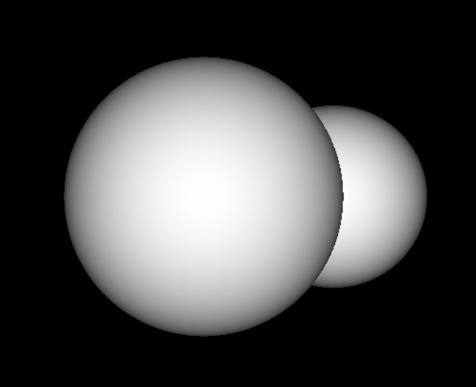

# Log Entry 1 - (26 March 2022)

## What have I done?
The first thing that I did after writing the previous log entry was to work on [writing a sphere intersection function](https://github.com/Muirey03/MiniRay/commit/c758c464ec359e36126a8d3c3d0c88988d752b5c). I had been talking to [@Muirey03](https://github.com/Muirey03) and it was clear that this was the next thing that we would need. Indeed, shortly after I [commited](https://en.wikipedia.org/wiki/Commit_(version_control)) code, Muirey was able to get [actual raycasting working](https://github.com/Muirey03/MiniRay/commit/ea8c1f58ac90261ba0edbb4a4b880ce5a3db9bf3)! The picture above is a screenshot of this. No more stock photos from here on out! In order to help with collaboration, I also setup a [Discord](https://en.wikipedia.org/wiki/Discord_(software)) server for us to use when communicating. Muirey and I then researched the possibility of using [WebAssembly](https://en.wikipedia.org/wiki/WebAssembly) for increased performance. After that, I [updated our function for iterating through direction vectors](https://github.com/Muirey03/MiniRay/commit/3008889e680eba72b75241a41398524c6313d5b3) based on [@MohammedMohsinAhmed](https://github.com/MohammedMohsinAhmed)'s [newly implemented matrix code](https://github.com/Muirey03/MiniRay/commit/39a288340891cd6300f8071254010a3067b342f2) and [Muirey's maths guidance](https://github.com/Muirey03/MiniRay/commit/7ba2c2f22eaa05aada4a666ad348db75d1b22b5d).

## What have I learned?
Firstly, it was nice to do some "simple" [vector](https://en.wikipedia.org/wiki/Vector_(mathematics_and_physics)) arithmetic again. While the maths for detecting a vector-sphere intersection is not trivial, at least it does not involve dealing with vector [spaces](https://en.wikipedia.org/wiki/Vector_space) and [bases](https://en.wikipedia.org/wiki/Basis_(linear_algebra)) like my [linear algebra](https://en.wikipedia.org/wiki/Linear_algebra) module does. It was also nice to discover a practical use for some maths that I had learnt at [A-Level](https://en.wikipedia.org/wiki/A-Level). The research that Muirey and I did on WebAssembly was also particularly interesting. While using WebAssembly in some cases [may have given us a performance increase](https://medium.com/samsung-internet-dev/performance-testing-web-assembly-vs-javascript-e07506fd5875), it was not clear-cut, especially due to the [clever optimisations of newer JavaScript engines](https://surma.dev/things/js-to-asc/). In the end, we decided to stick with JavaScript for now, but to potentially revisit WebAssembly if greater performance is required down the line.

## What will I change?
Things have been going well so far, but there are definitely a few things that I would like to improve, especially when it comes to my approach when tackling new coding problems. I have found that I often rush into coding without taking the time to think through what I'm about to do beforehand. This can be problematic, especially when dealing with the complex combination of mathematics and code, and is a big part of why I needed Muirey's help to sort my maths out. Another thing that I want to be careful with is making sure that I don't get tied-up in unnecessary admin. Upon reflection, I do think that setting up the Discord server was worthwhile, but I know that I have a tendency to go over the top with admin and I want to make sure that this doesn't happen with this project.

## What will I do next?
My plans for the next two weeks are to focus on the issues that I have outlined above, along with continuing to help with [MiniRay](https://github.com/Muirey03/MiniRay). I am also hoping that we will have a simple version of [ray tracing](https://en.wikipedia.org/wiki/Ray_tracing_(graphics)) (as opposed to [ray casting](https://en.wikipedia.org/wiki/Ray_casting)) implemented by then.