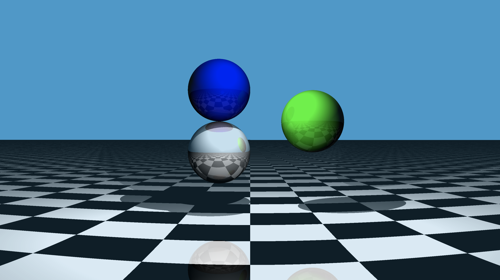

# Log Entry 2 - (8 April 2022)

NOTE: I've done this log entry a bit earlier than I would have liked because I'm going away for a week.

## What have I done?

Since the last log, the project has really been starting to come together. The lighting system was overhauled by [@MohammedMohsinAhmed](https://github.com/MohammedMohsinAhmed) and [@Muirey03](https://github.com/Muirey03) added checkered [planes](<https://en.wikipedia.org/wiki/Plane_(geometry)>). With those changes, we were now ready to convert our ray casting code into ray tracing! I was lucky enough to be the person to make these changes, and I had a lot of fun writing a [recursive](https://en.wikipedia.org/wiki/Recursion) ray tracing function. I am really happy with the results, which are pictured above, although it does take 10 seconds to render at that resolution!

## What have I learned?

Combining Mohsin and Muirey's code has definitely helped with my code reading skills, although I still feel like I should focus more on this before I start making my own changes. In particular, I should have tried to understand Mohsin's illumination code more before using it.

## What will I change?

I still want to prioritise taking my time to understand problems before I try to code a solution. Doing so would have saved me a lot of time over the past two weeks, and this is an area that I really want to improve in.

## What will I do next?

While we've reached our goal of ray tracing, there are still many improvements that can be made to the rendering engine and a potential for extending the project with other shapes and geometries. I'm particularly interested in rendering 3D [fractals](https://en.wikipedia.org/wiki/Fractal), so I'm planning to investigate that further.
