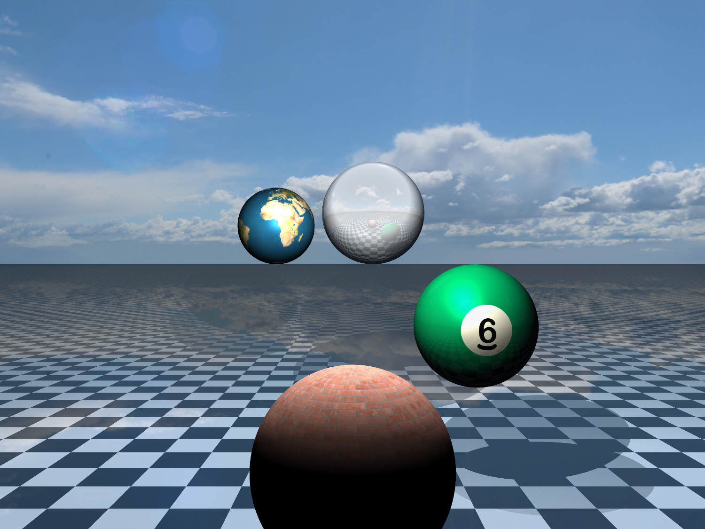

# Log Entry 3 - (27 April 2022)

NOTE: This is my 4th log entry because I started counting at zero. 😃

## What have I done?

In the end, I decided not to pursue adding additional features myself because [@MohammedMohsinAhmed](https://github.com/MohammedMohsinAhmed) and [@Muirey03](https://github.com/Muirey03) had done a great job implementing [textures](https://en.wikipedia.org/wiki/Texture_mapping), adding [anti-aliasing](https://en.wikipedia.org/wiki/Supersampling) and fixing [bugs](https://en.wikipedia.org/wiki/Software_bug) while I was away (see the image above). Instead, I caught up on the state of the project and [reviewed](https://en.wikipedia.org/wiki/Code_review) their code. Overall the changes they made were good, and I discussed some of them with them both. I then experimented with changing the anti-aliasing sampling method and minor performance tweaks.

## What have I learned?

I found that taking the time to read Muirey and Mohsin's code was very valuable, and I enjoyed working out why they had taken certain approaches to solving problems. I definitely feel like I'm making some progress in this area. I also learnt that, surprisingly (to me at least), [Safari](<https://en.wikipedia.org/wiki/Safari_(web_browser)>) was faster than either [Chrome](https://en.wikipedia.org/wiki/Google_Chrome) or [Firefox](https://en.wikipedia.org/wiki/Firefox) at rendering our scene. I thought that the fabled [V8](<https://en.wikipedia.org/wiki/V8_(JavaScript_engine)>) engine would destroy the competition, and I have to say that I'm now tempted to jump ship from Firefox to Safari.
| Browser | JS Engine | Render Time |
| -------------------------------------------------------------- | ---------------------------------------------------------------------- | ----------: |
| [Safari](<https://en.wikipedia.org/wiki/Safari_(web_browser)>) | [JavaScript Core](https://en.wikipedia.org/wiki/WebKit#JavaScriptCore) | 4223 ms |
| [Chrome](https://en.wikipedia.org/wiki/Google_Chrome) | [V8](<https://en.wikipedia.org/wiki/V8_(JavaScript_engine)>) | 5445 ms |
| [Firefox](https://en.wikipedia.org/wiki/Firefox) | [SpiderMonkey](https://en.wikipedia.org/wiki/SpiderMonkey) | 11399 ms |

## What will I change?

Upon reflection, I still need to prioritise thinking through problems more. My tendancy to jump right into coding still hinders me greatly, and I think that this is the single most important thing that I need to work on going forward. Also, there were times when we all sort of "did our own thing," loosely based upon what others had done before. If I were doing this again, I think I would try to schedule a more formal catch-up where we all talked about the state of the project and planned next steps.

## What will I do next?

At first, I was a bit apprehensive about this assignment, but I have really enjoyed writing about what I've done, and it's exciting to have a record of what I've done with a project for once. Perhaps I'll take the traditional CompSci student route and start a blog! I've also particularly liked working with Mohsin and Muirey, and I would love to work on more projects with them in the future.

---

Happy coding!
\- Amren
